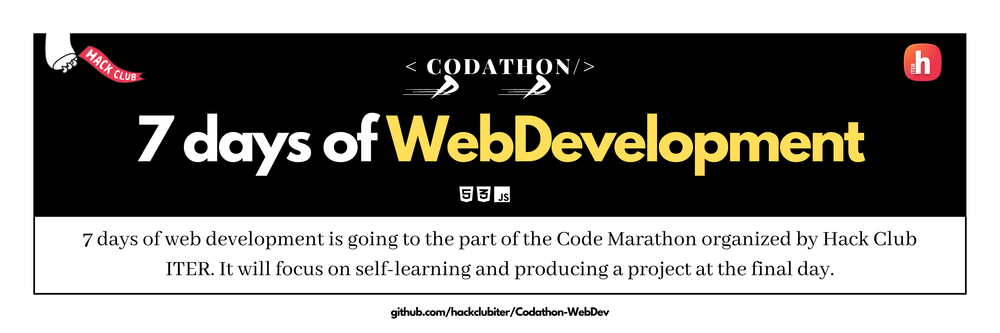

7 days of Web Development is a part of the part of Code Marathon organized by hack Club ITER. It is a marathon which will focus on self-learning and producing a project at the final day.

## Quick Links:
1. [HTML by w3schools](https://www.w3schools.com/html/)
2. [CSS by css-tricks](https://css-tricks.com/)
3. [JavaScript by freecodecamp](https://www.freecodecamp.org/learn/javascript-algorithms-and-data-structures/)

## About
Welcome to this 7 days of Web - Development👋

It is an initiative for people to learn how to build web applications, irrespective of their current level of expertise. ✌ 

The main objective behind this program is to provide you with access to top-notch content at zero cost. ✨

It'll be a week long intensive and hardcore learning marathon. 

We have designed beginner-friendly lessons covering up HTML, CSS and JavaScript. The topics have been distributed over the course of 6 days. 

And then for the last and final day of this event, all the participants will have to submit a project which they must make within that week only. No previously prepared project will be accepted. 

Furthermore, there are quizzes to be conducted at the end of each day to help you sharpen your basics in a fun and riveting way. 💛

So see you at the end of this week. 👍

## Days-wise plan
- Day-1 : HTML Part - 1
- Day-2 : HTML Part - 2
- Day-3 : CSS Part - 1
- Day-4 : CSS Part - 2
- Day-5 : JS Part - 1
- Day-6 : JS Part - 2
- Day 7 : Final Project

## Day-wise Assignment
- [Day-1](https://github.com/hackclubiter/Codathon-WebDev/blob/main/Day-1/README.md) 
- [Day-2](https://github.com/hackclubiter/Codathon-WebDev/blob/main/Day-2/README.md)
- [Day-3](https://github.com/hackclubiter/Codathon-WebDev/blob/main/Day-3/README.md) 
- [Day-4](https://github.com/hackclubiter/Codathon-WebDev/blob/main/Day-4/README.md)
- [Day-5](https://github.com/hackclubiter/Codathon-WebDev/blob/main/Day-5/README.md)
- [Day-6](https://github.com/hackclubiter/Codathon-WebDev/blob/main/Day-6/README.md)
- [Day-7](https://github.com/hackclubiter/Codathon-WebDev/blob/main/Day-7/README.md)

## Coordinators
1. Saswat Mohanty
2. Sanket Sanjeeb Pattanaik 
3. Ankit Raj Biswal
4. Rahul Anand Sahu

## FAQs
- **Are there any prerequisite for this event?**

    There are no prerequisities for the event. Just your inquisitiveness and eagerness to learn.

## Contact
- [Mail](mailto:hackclubiter@gmail.com)
- [Telegram Group](https://t.me/joinchat/TBY1nvuLJKJVeY5y)
- [Instagram DM](https://www.instagram.com/hackclubiter/)

## Perks:
- Certificate of Appreciation to top 3 performers
- Certificate of Participation to all participants who will successfully submit their assignment and project.
- Bagful of knowledge

## Code of Conduct
-
-
-
-

